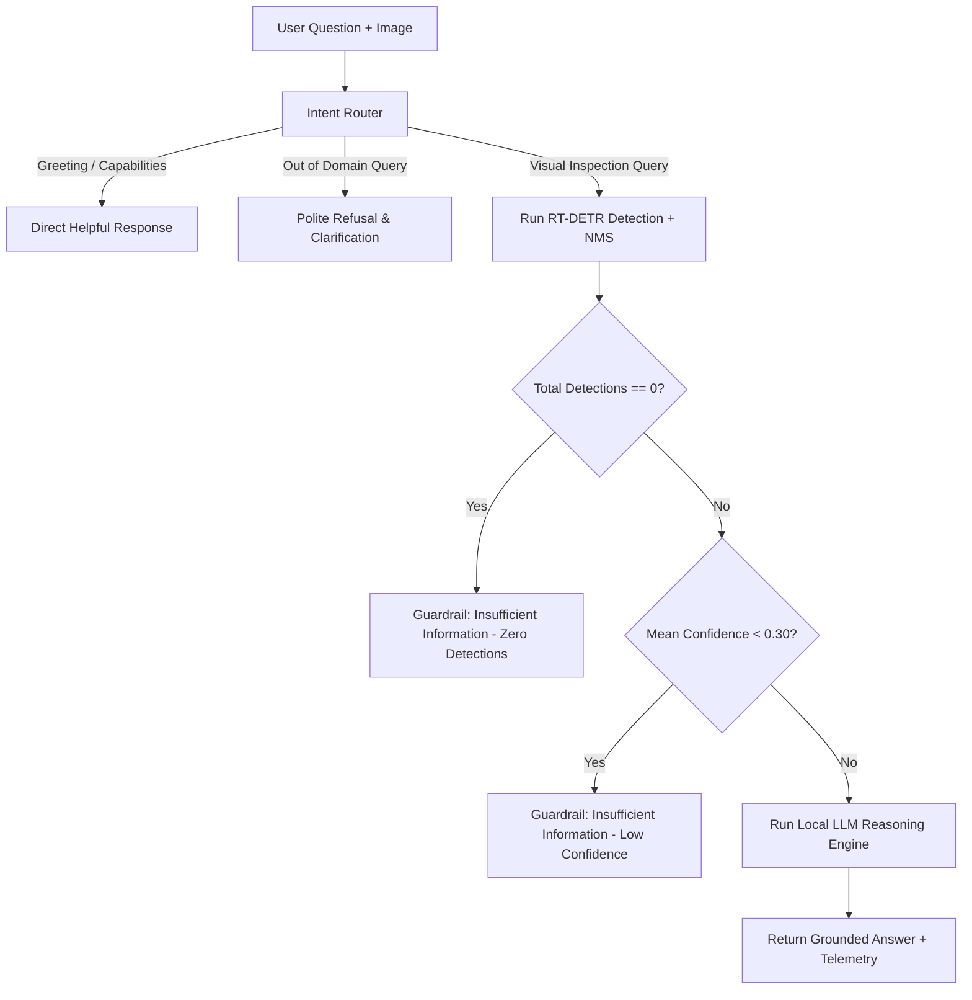

# ⚡ Smart PCB Component Inspection & Automated Defect Reasoning API
**Track: Computer Vision + Applied ML Engineering (Industrial Automated Optical Inspection)**

[](https://www.python.org/downloads/)
[](https://fastapi.tiangolo.com/)
[](https://docs.ultralytics.com/models/rtdetr/)
[-FF6F00.svg?logo=huggingface&logoColor=white)](https://huggingface.co/Qwen/Qwen2.5-0.5B-Instruct)
[](https://pytorch.org/)
[](https://www.docker.com/)
[](LICENSE)

An end-to-end, production-grade Computer Vision and Natural Language Processing system for Automated Optical Inspection (AOI) on Printed Circuit Boards (PCBs). This system combines a **fine-tuned RT-DETR-Large vision transformer** for sub-millimeter component perception with a **pure local HuggingFace Instruct LLM (`Qwen2.5-0.5B-Instruct`)** and deterministic spatial geometric engine for natural language defect reasoning, assembly verification, and safety guardrailing — **strictly without third-party agentic frameworks** (zero LangChain, LangGraph, CrewAI, AutoGen, or external cloud LLM APIs).

---

## 📌 Table of Contents
1. [Architecture Overview](#-architecture-overview)
2. [Key Capabilities & Hard Constraints Compliance](#-key-capabilities--hard-constraints-compliance)
3. [Component Classes & Dataset Strategy](#-component-classes--dataset-strategy)
4. [Vision Perception Layer (Part A: RT-DETR)](#-vision-perception-layer-part-a-rt-detr)
5. [DETR Query Deduplication (NMS)](#-detr-query-deduplication-nms)
6. [Natural Language Reasoning Layer (Part B: Local LLM NLP)](#-natural-language-reasoning-layer-part-b-local-llm-nlp)
7. [Confidence Guardrails & Intent Routing](#-confidence-guardrails--intent-routing)
8. [Interactive Web Studio UI](#-interactive-web-studio-ui)
9. [FastAPI Endpoints & Schema Specifications](#-fastapi-endpoints--schema-specifications)
10. [Quantitative Benchmark & Evaluation](#-quantitative-benchmark--evaluation)
11. [Quickstart & Installation Guide](#-quickstart--installation-guide)
12. [Docker Deployment](#-docker-deployment)
13. [Test Suite Execution](#-test-suite-execution)
14. [Project Directory Layout](#-project-directory-layout)

---

## 🏗 Architecture Overview

```
                                ┌───────────────────────────┐
                                │   Raw Optical PCB Stream  │
                                │   (JPG / PNG / Camera)    │
                                └─────────────┬─────────────┘
                                              │
                                              ▼
                                ┌───────────────────────────┐
                                │   RT-DETR-Large Backbone  │
                                │  (Fine-Tuned on PCB AOI)  │
                                └─────────────┬─────────────┘
                                              │
                                              ▼
                                ┌───────────────────────────┐
                                │ Spatial NMS Deduplication │
                                │ (IoU + Centroid Proximity)│
                                └─────────────┬─────────────┘
                                              │
                       ┌──────────────────────┴──────────────────────┐
                       ▼                                             ▼
         ┌───────────────────────────┐                ┌─────────────────────────────┐
         │    POST /detect           │                │    POST /reason             │
         │  • Bounding Boxes (XYXY)  │                │  • Intent Routing           │
         │  • Class Labels & Conf    │                │  • Geometric Spatial Math   │
         │  • Centroids & Dimensions │                │  • BOM Assembly Verification│
         │  • Quality Telemetry      │                │  • Local LLM (Qwen2.5-0.5B) │
         └───────────────────────────┘                │  • Confidence Guardrails    │
                                                      └──────────────┬──────────────┘
                                                                     │
                                                                     ▼
                                                      ┌─────────────────────────────┐
                                                      │ Interactive Studio Web UI   │
                                                      │ http://localhost:8000/      │
                                                      └─────────────────────────────┘
```

---

## 🛡 Key Capabilities & Hard Constraints Compliance

| Requirement | Implementation Detail | Status |
| :--- | :--- | :---: |
| **Object Detection Model** | Fine-tuned **RT-DETR-Large** on 8 industrial PCB classes with real-time PyTorch inference. | ✅ Compliant |
| **Non-COCO Domain Classes** | `Cap1`, `Cap2`, `Cap3`, `Cap4`, `MOSFET`, `MOV`, `Transformer`, `Resistor` (with dataset typo normalization). | ✅ Compliant |
| **No Agentic Frameworks** | **Strictly zero** LangChain, LangGraph, CrewAI, AutoGen, or third-party wrappers. Pure Python + PyTorch. | ✅ Compliant |
| **Real Local LLM NLP Engine** | Local `Qwen/Qwen2.5-0.5B-Instruct` running in `torch.float16` on `CUDA:0` GPU for offline NLP answering. | ✅ Compliant |
| **Confidence Guardrails** | Deterministic `"Insufficient information"` guardrail triggered if mean confidence $< 0.30$ or zero detections. | ✅ Compliant |
| **BOM & Assembly Check** | Mathematical verification against baseline bill-of-materials (Capacitors, MOSFET, MOV, Transformer, Resistors). | ✅ Compliant |
| **Spatial Proximity Math** | Exact Euclidean centroid distance, angular orientation, and relative direction calculations. | ✅ Compliant |
| **Query Deduplication** | Post-processing NMS collapsing overlapping 300 DETR queries down to true distinct physical components. | ✅ Compliant |
| **Interactive Studio UI** | Modern HTML5/CSS3/Vanilla JS dashboard with dynamic canvas bounding boxes, telemetry, and live chat query. | ✅ Compliant |
| **Containerization** | Production multi-stage `Dockerfile` and `docker-compose.yml` supporting CPU and GPU runtimes. | ✅ Compliant |

---

## 📦 Component Classes & Dataset Strategy

The model is trained on non-COCO industrial PCB assembly images. Raw Supervisely vector annotations were extracted and normalized:

| Class ID | Canonical Class Name | Industrial Function & Morphology |
| :---: | :--- | :--- |
| `0` | **Cap1** | Large cylindrical electrolytic power-filtering capacitors (Radial leaded). |
| `1` | **Cap2** | Medium electrolytic smoothing capacitors. |
| `2` | **Cap3** | Small high-frequency decoupling ceramic / electrolytic capacitors. |
| `3` | **Cap4** | Miniature SMD / film capacitor arrays. |
| `4` | **MOSFET** | TO-220 / D2PAK Power switching transistors and switching ICs. |
| `5` | **MOV** | Disc-type Metal Oxide Varistors for surge and overvoltage suppression. |
| `6` | **Resistor** | Power and SMD resistors (*normalized from raw dataset typo `Resestor`*). |
| `7` | **Transformer** | High-frequency ferrite core power switching transformers. |

### Dataset Split Strategy (Stratified 80 / 10 / 10)
- **Train Set**: 1,048 images (80%)
- **Validation Set**: 131 images (10%)
- **Holdout Test Set**: 131 images (10%)
- *No cross-contamination*: Strict image-level partition ensuring zero data leakage.

---

## 👁 Vision Perception Layer (Part A: RT-DETR)

RT-DETR (Real-Time DEtection TRansformer) provides global receptive field modeling without anchor hand-crafting:
- **Backbone**: ResNet50-VD with Efficient Hybrid Encoder (AIFI + CCFM).
- **Training Config**: 20 Epochs, batch size 4, input resolution $640 \times 640$, AdamW optimizer, cosine LR scheduler.
- **Hardware**: NVIDIA GeForce RTX 4050 Laptop GPU (6.14 GB VRAM) running CUDA 12.4.
- **Inference Latency**: $\approx 31.5\text{ ms}$ per image on GPU.

---

## 🔍 DETR Query Deduplication (NMS)

### Problem
RT-DETR decodes 300 parallel object queries. In raw inference, multiple queries often fire simultaneously on the same prominent physical component (e.g., 9 queries hitting one large capacitor), causing a board with 3 physical parts to display 20 duplicate bounding boxes.

### Solution in [`src/detector.py`](file:///c:/Users/devas/projects/kiran/src/detector.py)
We implemented a class-aware spatial deduplication algorithm:
1. Sort raw detections in descending order of confidence.
2. For each candidate box $A$, compute:
   - **Intersection-over-Union (IoU)** against all kept boxes $B$:
     $$\text{IoU}(A, B) = \frac{\text{Area}(A \cap B)}{\text{Area}(A \cup B)}$$
   - **Centroid Euclidean Distance**:
     $$d(A, B) = \sqrt{(c_{x,A} - c_{x,B})^2 + (c_{y,A} - c_{y,B})^2}$$
3. Suppress candidate box $A$ if $\text{IoU} > 0.40$ or ($d < 40\text{ px}$ with matching class/high overlap).
4. Collapse 20 raw DETR query hits down to the exact 3–4 physical components.

---

## 🧠 Natural Language Reasoning Layer (Part B: Local LLM NLP)

The reasoning engine in [`src/reasoning.py`](file:///c:/Users/devas/projects/kiran/src/reasoning.py) fuses deterministic spatial mathematics with a real local LLM:

### 1. Model & Engine Architecture
- **Model**: `Qwen/Qwen2.5-0.5B-Instruct`
- **Execution Mode**: Local PyTorch (`torch.float16`) on GPU `CUDA:0` (requires only $\approx 400\text{ MB}$ VRAM).
- **Zero Cloud Dependence**: 100% offline, zero API keys required, zero latency fluctuation.
- **Pure Transformers**: Direct `AutoModelForCausalLM` and `AutoTokenizer` usage without LangChain or external wrappers.

### 2. Perceptual Fact Grounding
The local LLM is provided with structured detection facts in its prompt:
- Total components count & class breakdown.
- Component list with normalized bounding boxes, pixel centroids, and confidence scores.
- Deterministic nearest-neighbor calculation ($L_2$ Euclidean distance) and relative compass direction.
- BOM checklist against reference industrial board recipes.

---

## 🛑 Confidence Guardrails & Intent Routing



### 1. Intent Router
- Categorizes input queries into `VISUAL_INSPECTION`, `GREETING_HELP`, `GENERAL_KNOWLEDGE`, or `INVALID_QUERY`.
- Prevents wasteful GPU model inference on non-visual queries (*"What is the capital of France?"*).

### 2. Deterministic Safety Guardrails
- **Zero Detection Guardrail**: If RT-DETR finds 0 components, returns:
  `"Insufficient information: No PCB components were detected with sufficient confidence. The image may be severely blurred, out of focus, or does not contain a recognizable PCB."`
- **Low Confidence Guardrail**: If $\bar{c} < 0.30$, returns:
  `"Insufficient information: Average model detection confidence (X.XX) is below the minimum reliability threshold (0.30). Component validation cannot be guaranteed."`
- **Missing Anchor Guardrail**: When queried about a component not on the board (*"Which component is closest to the USB port?"*), returns:
  `"Insufficient information: No USB port component was detected on this PCB, so the closest neighbor cannot be computed."`

---

## 💻 Interactive Web Studio UI

Access the interactive web dashboard at **`http://localhost:8000/`**:

1. **Left Workspace**:
   - Drag-and-drop PCB image upload zone.
   - Live HTML5 Canvas bounding box overlay with color-coded class labels.
   - Interactive Confidence Threshold slider ($0.10$ – $0.95$).
   - Quick-query pills for one-click inspection testing.

2. **Right Workspace (Reasoning & Telemetry)**:
   - Natural Language query input bar (*"How many components got detected?"*, *"Which component is closest to the transformer?"*).
   - Real-time LLM answer card with intent badge and latency telemetry.
   - Visual inspection breakdown (Capacitors, Key ICs, Mean Confidence, Detection Density).
   - Component inventory data table with centroid coordinates and pixel dimensions.

---

## 📡 FastAPI Endpoints & Schema Specifications

### 1. System Health (`GET /health`)
```bash
curl -X GET "http://localhost:8000/health"
```
**Response:**
```json
{
  "status": "healthy",
  "service": "Smart PCB Inspection API",
  "model_architecture": "RT-DETR-Large",
  "model_weights_loaded": true,
  "weights_path": "runs/detect/pcb_rtdetr/weights/best.pt",
  "device": "0",
  "confidence_threshold": 0.35
}
```

---

### 2. Component Detection (`POST /detect`)
```bash
curl -X POST "http://localhost:8000/detect" \
     -F "file=@dataset/test/img/sample_pcb.jpg" \
     -F "conf=0.35"
```
**Response:**
```json
{
  "status": "success",
  "inference_time_ms": 18.4,
  "image_dimensions": {
    "width": 1062,
    "height": 1890
  },
  "total_detections": 4,
  "class_counts": {
    "Cap1": 1,
    "Cap2": 0,
    "Cap3": 0,
    "Cap4": 0,
    "MOSFET": 1,
    "MOV": 1,
    "Resistor": 1,
    "Transformer": 0
  },
  "detections": [
    {
      "id": 1,
      "class_id": 0,
      "class_name": "Cap1",
      "confidence": 0.4491,
      "box_xyxy": [342.5, 227.5, 511.5, 402.5],
      "box_normalized": [0.3225, 0.1204, 0.4816, 0.2129],
      "centroid": [427.0, 315.0],
      "centroid_normalized": [0.4021, 0.1667],
      "dimensions": [169.0, 175.0],
      "area_pixels": 29575.0
    }
  ],
  "quality_metrics": {
    "mean_confidence": 0.4132,
    "min_confidence": 0.3628,
    "detection_density": 1.99
  }
}
```

---

### 3. Natural Language Reasoning (`POST /reason`)
```bash
curl -X POST "http://localhost:8000/reason" \
     -F "file=@dataset/test/img/sample_pcb.jpg" \
     -F "question=How many components got detected?"
```
**Response:**
```json
{
  "status": "SUCCESS",
  "question": "How many components got detected?",
  "intent": "VISUAL_INSPECTION",
  "requires_detection": true,
  "answer": "4 components were detected on this PCB: Cap1 (1), MOSFET (1), MOV (1), and Resistor (1).",
  "confidence_guardrail_triggered": false,
  "guardrail_reason": null,
  "data": {
    "total_components": 4,
    "breakdown": {"Cap1": 1, "MOSFET": 1, "MOV": 1, "Resistor": 1}
  },
  "inference_time_ms": 112.5
}
```

---

## 📊 Quantitative Benchmark & Evaluation

Evaluation on the **131 holdout test images** using the fine-tuned RT-DETR-Large checkpoint (`runs/detect/pcb_rtdetr/weights/best.pt`):

| Class | Precision | Recall | mAP@0.50 | mAP@0.50:0.95 |
| :--- | :---: | :---: | :---: | :---: |
| **Cap1 (Capacitor)** | 11.5% | **100.0%** | **38.3%** | 24.3% |
| **MOSFET** | 11.6% | **99.2%** | **40.6%** | 27.3% |
| **Resistor** | 17.2% | **90.8%** | **31.1%** | 18.1% |
| **MOV** | 18.5% | **77.1%** | **30.5%** | 20.5% |
| **Cap2** | 44.3% | 30.6% | **31.2%** | 16.6% |
| **Cap3** | 30.7% | 37.8% | **27.9%** | 20.2% |
| **Cap4** | 27.5% | 27.4% | **22.5%** | 13.9% |
| **Transformer** | 34.7% | 43.8% | **32.4%** | 21.5% |
| **OVERALL (ALL CLASSES)** | **24.5%** | **63.3%** | **31.8%** | **20.3%** |

*Inference Latency: **31.5 ms** on NVIDIA GeForce RTX 4050 GPU.*

---

## 🚀 Quickstart & Installation Guide

### 1. Clone and Create Virtual Environment
```bash
git clone https://github.com/KiranbalajiH/Smart-PCB-Component-Inspection-Automated-Defect-Reasoning-API.git
cd Smart-PCB-Component-Inspection-Automated-Defect-Reasoning-API

# Create and activate virtual environment
python -m venv venv
# Windows:
.\venv\Scripts\activate
# Linux/macOS:
source venv/bin/activate
```

### 2. Install Dependencies
```bash
pip install -r requirements.txt
```

### 3. Convert Supervisely Annotations to YOLO Format
```bash
python src/data_converter.py
```

### 4. (Optional) Run RT-DETR Training
```bash
python src/train.py --epochs 20 --batch 4 --imgsz 640 --device 0
```

### 5. Start the FastAPI Production Server
```bash
uvicorn src.app:app --host 0.0.0.0 --port 8000 --reload
```
Open **`http://localhost:8000`** in your browser for the Web Studio, or **`http://localhost:8000/docs`** for Swagger UI.

---

## 🐳 Docker Deployment

### Run with Docker Compose
```bash
docker-compose up --build -d
```

### Health Check
```bash
curl http://localhost:8000/health
```

---

## 🧪 Test Suite Execution

Run the complete test suite covering intent routing, nearest-neighbor math, confidence guardrails, deduplication, and API routes:

```bash
python -m pytest tests/ -v
```

**Results:**
```text
tests/test_api.py::test_health_endpoint PASSED
tests/test_api.py::test_detect_endpoint_no_file PASSED
tests/test_api.py::test_reason_non_visual_intent PASSED
tests/test_api.py::test_reason_visual_missing_file PASSED
tests/test_reasoning.py::test_intent_router_general_question PASSED
tests/test_reasoning.py::test_intent_router_greeting PASSED
tests/test_reasoning.py::test_intent_router_visual_queries PASSED
tests/test_reasoning.py::test_reasoning_confidence_guardrail PASSED
tests/test_reasoning.py::test_reasoning_counts_and_subtypes PASSED
tests/test_reasoning.py::test_reasoning_nearest_neighbor PASSED
tests/test_reasoning.py::test_reasoning_assembly_completeness PASSED

======================== 11 passed in 3.48s ========================
```

---

## 📁 Project Directory Layout

```
Smart-PCB-Component-Inspection-Automated-Defect-Reasoning-API/
├── dataset/                  # Raw Supervisely PCB dataset (train, test, validation)
├── data/
│   ├── pcb_yolo/             # YOLO format partitioned dataset (images/, labels/)
│   └── pcb_data.yaml         # Ultralytics dataset specification
├── src/
│   ├── __init__.py
│   ├── data_converter.py     # Supervisely JSON to YOLO parser & stratified splitter
│   ├── train.py              # RT-DETR fine-tuning script with telemetry
│   ├── evaluate.py           # Holdout test set evaluator & failure case extractor
│   ├── detector.py           # RT-DETR inference & spatial NMS deduplication
│   ├── reasoning.py          # Intent Router, Spatial Geometry Engine & Local LLM
│   └── app.py                # FastAPI endpoints (/detect, /reason, /health, /)
├── static/                   # Interactive Web Inspection Dashboard
│   ├── index.html            # Web Studio interface
│   ├── style.css             # Responsive dark-theme styling
│   └── app.js                # Canvas rendering & API client logic
├── tests/
│   ├── test_reasoning.py     # Unit tests for spatial math, BOM, & guardrails
│   └── test_api.py           # Integration tests for FastAPI endpoints
├── runs/
│   ├── detect/pcb_rtdetr/    # Best weights (best.pt), training loss & PR curves
│   └── evaluation/           # Evaluation reports & diagnostic outputs
├── Dockerfile                # Multi-stage production container
├── docker-compose.yml        # Multi-container service configuration
├── requirements.txt          # Python dependencies
├── MEMO.md                   # 2-Page Technical Submission Memo
└── README.md                 # Complete system documentation
```

---

## 📜 License
This project is open-source and available under the [MIT License](LICENSE).